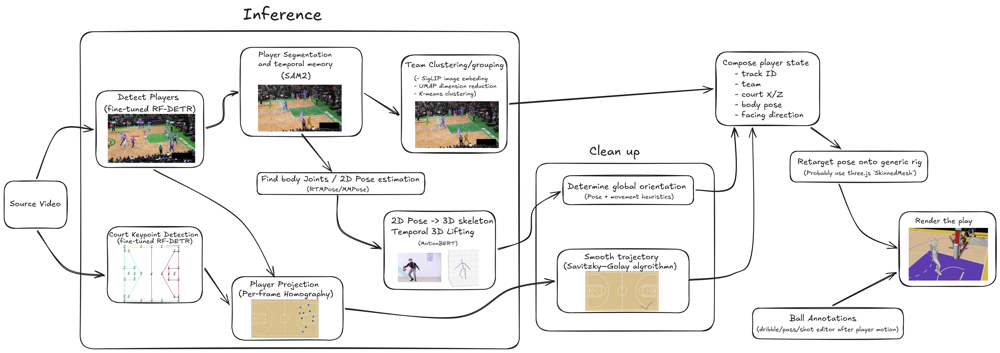

# nba_3d_scene_reconstruction

## Summary

The goal of this project is too create a CV pipeline that can ingest a basketball clip, and reconstruct the scene in 3js with human meshes. The 3d scene should accurately recreate the ingestted clip, and allow replay from any angle or perspective.

This can be done by using multiple models to solve sub problems, such as player detection, team clustering, court keypoint detection, ect. When combined together, enough information can be gathered to recreate the scene

## Requirements/Goals


#### Functional:

**1. Player detection + tracking:**
- The system should dtect basketball players in each processed frame. (should be able to distinguish crowd and referees from active players)
- The system should continue a player track even across a limited number of missing detections
- Persistent `track_id` should be assigned to each detected player to uniquely identify them
- Maintain identity over frames, and attempt to preserve the same track id trhough rapid movements, temporary occlusion, player overlap.

**2. Team assignment:**
- The system should be able to cluster players into two teams, which shall be represented be colors
```
cluster 0 → red
cluster 1 → blue
```

**3. Court keypoint detection + Homography:**

- The system shall detect predefined basketball-court landmarks in each relevant frame.
- The system shall convert each player’s image-space ground point into a court-space using an image-to-court homography for each calibrated frame.

**4. Trajectory correction:**

- The system shall identify implausible frame-to-frame player movements, and smooth movement to be realistic
- The system should be able to interpolate missing player positions for short gaps.

**5. Pose estimation:**

- The system shall estimate body joints for each tracked player.

A basic skeleton should include:
```
head or nose
shoulders
elbows
wrists
hips
knees
ankles
```
- Every pose estimate shall be attached to an existing player track.

**6. Three.js visualization**

- Frontend should display a correctly scaled 3D basketball court
- Create a generic rigged human for each active player.
- Players shall be displayed as red, blue to distunguish teams
- Animate player positions and poses based on animation data
- The viewer shall support camera controls, such as zooming, and viewing from others perspective

-  Support manual correction, like player ID merge.
- Create Ball events where user can annoate things like:
```
left-hand contact
right-hand contact
dribble
pass
catch
```

- The system shall generate ball paths for dribbles, passes, and shots.

#### Non Functional:

- The player detector should achieve an acceptable precision/recall level on representative broadcast clips.
- Team assignment should achieve: 95% > accuracy
- viewer frame rate should be at least 30 FPS
- Video processing jobs shall be independently executable by workers.


## High Level Design

This whole pipeline can be seen as a bunch of subcomponents that are combined together to gain all the nesscary info to recreate the scene. We will combine multiple Computer Vision techniques and models to solve these subproblems.


