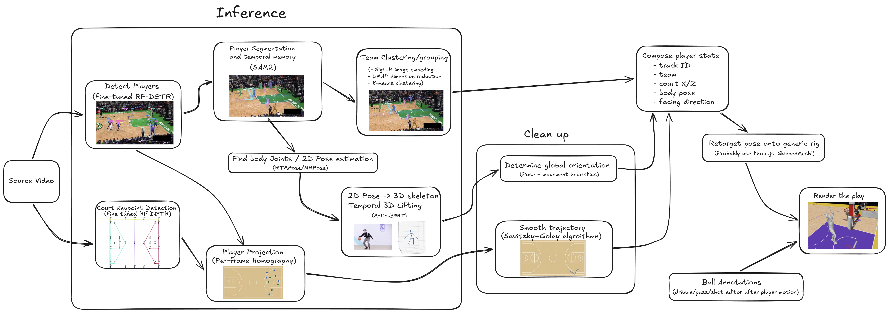

# nba_3d_scene_reconstruction

#### Demos:

**Requirements + HLD design + low Level design (below in the README)**:



**Player tracking and unique identification (8/24):**

https://github.com/user-attachments/assets/a7482237-7b0e-4695-8338-80ef4f4b170a

**Keypoint detection + Homography (WIP)**

**Pose estimation + Lifing (WIP)**

**Visalize to Three.js (WIP)**

## Tracking observations and court projection

Run the models with court detection and a fresh homography attempt on every frame:

```bash
uv run --extra gpu --env-file .env tracking-demo path/to/clip.mp4 \
  --court-projection --max-frames 60
```

This writes a synchronized diagnostic video to
`artifacts/<clip_id>/segment_001/debug/court_debug.webm`. Its left side shows
the source video with masks, IDs, player footpoints, detected court keypoints,
and canonical landmarks reprojected through the homography. Its right side
shows only raw player dots and IDs on a fixed top-down court. Calibration
metrics remain available in `calibrations.jsonl` without cluttering the video.

The command also writes four JSONL files under
`artifacts/<clip_id>/segment_001/`: `observations.jsonl`,
`court_detections.jsonl`, `calibrations.jsonl`, and
`player_court_positions_raw.jsonl`. The environment must configure both the
player and court models as described in `.env.example`.

Use `--court-interval 5` to reduce hosted court-model calls if per-frame
calibration is too slow. Failed frames temporarily hold the most recent valid
transform for up to 15 frames.

SAM 2 stores video frames and tracking history in CPU RAM by default to leave
GPU memory available for inference. Its model still runs on the GPU. CPU
storage can slow processing and increases host-memory use; it does not change
the output resolution or playback FPS. Retired tracks are also removed from
SAM 2's internal state. On a GPU with more memory, a custom runner can pass
`offload_video_to_cpu=False` and/or `offload_state_to_cpu=False` to
`Sam2PlayerTracker`.

`PlayerTrackingPipeline.process_frame()` still returns masks; its
`observations` attribute contains the latest frame's `PlayerObservation`
records. Pass the video's actual `fps` when constructing the tracker (the
standalone default is 30). Observations use the largest connected mask
component and estimate the footpoint at the bottom, with x taken from the
median of the lowest 5% of the component's height. When a live track has an
empty or absent mask, its latest detector box supplies a provisional
bottom-center footpoint. The observation remains marked missing and carries a
`bbox_footpoint_fallback` flag so downstream cleanup can treat it accordingly.
Detection confidence is recorded only on frames where that track was matched
or created by the detector. Mask-derived observations retain
`sam2_propagation` provenance; checkpoint re-prompts affect subsequent
propagation. Masks remain in memory and `mask_ref` is unset.

`SceneReconstructionPipeline` joins those observations with per-frame
calibrations and returns a `SceneFrame`. Court detection runs every frame by
default. When an interval is configured or a detection fails, it can hold the
last valid calibration for up to 15 frames.
Create a new tracking/scene pipeline per continuous segment; starting it
resets calibration for that segment. Camera-cut detection is not automatic.

The player detector defaults to confidence `0.66` and class-agnostic NMS at
IoU `0.90`. Before a new track is created, the scene pipeline projects the
detection's bottom-center point and rejects it when it falls beyond the
configured 100 cm court margin. Existing SAM tracks can survive a brief missed
detection, so this filter does not make short occlusions disappear.

`court/projector.py` returns `PlayerCourtPosition` records with `raw_court_xy`
in **centimeters**, plus the calibration source frame, age, and quality flags.
Invalid calibration, missing footpoints, projection at infinity, and positions
outside the court plus a configurable 100 cm margin produce a null position.
Footpoints are approximate floor contacts; jumping and occlusion still need
later trajectory cleanup. The top-down view deliberately shows raw positions
so calibration and footpoint failures stay visible. Three.js export remains a
future step.

## Summary

The goal of this project is too create a CV pipeline that can ingest a basketball clip, and reconstruct the scene in 3js with human meshes. The 3d scene should accurately recreate the ingestted clip, and allow replay from any angle or perspective.

This can be done by using multiple models to solve sub problems, such as player detection, team clustering, court keypoint detection, ect. When combined together, enough information can be gathered to recreate the scene

## Requirements/Goals


#### Functional:

**1. Player detection + tracking:**
- The system should dtect basketball players in each processed frame. (should be able to distinguish crowd and referees from active players)
- The system should continue a player track even across a limited number of missing detections
- Persistent `track_id` should be assigned to each detected player to uniquely identify them
- Maintain identity over frames, and attempt to preserve the same track id trhough rapid movements, temporary occlusion, player overlap.

**2. Team assignment:**
- The system should be able to cluster players into two teams, which shall be represented be colors
```
cluster 0 → red
cluster 1 → blue
```

**3. Court keypoint detection + Homography:**

- The system shall detect predefined basketball-court landmarks in each relevant frame.
- The system shall convert each player’s image-space ground point into a court-space using an image-to-court homography for each calibrated frame.

**4. Trajectory correction:**

- The system shall identify implausible frame-to-frame player movements, and smooth movement to be realistic
- The system should be able to interpolate missing player positions for short gaps.

**5. Pose estimation:**

- The system shall estimate body joints for each tracked player.

A basic skeleton should include:
```
head or nose
shoulders
elbows
wrists
hips
knees
ankles
```
- Every pose estimate shall be attached to an existing player track.

**6. Three.js visualization**

- Frontend should display a correctly scaled 3D basketball court
- Create a generic rigged human for each active player.
- Players shall be displayed as red, blue to distunguish teams
- Animate player positions and poses based on animation data
- The viewer shall support camera controls, such as zooming, and viewing from others perspective

-  Support manual correction, like player ID merge.
- Create Ball events where user can annoate things like:
```
left-hand contact
right-hand contact
dribble
pass
catch
```

- The system shall generate ball paths for dribbles, passes, and shots.

#### Non Functional:

- The player detector should achieve an acceptable precision/recall level on representative broadcast clips.
- Team assignment should achieve: 95% > accuracy
- viewer frame rate should be at least 30 FPS
- Video processing jobs shall be independently executable by workers.


## High Level Design

This whole pipeline can be seen as a bunch of subcomponents that are combined together to gain all the nesscary info to recreate the scene. We will combine multiple Computer Vision techniques and models to solve these subproblems.


### Player Detection

We need to find every active player in the video frame.

**Output:** one bounding box and confidence score per detected player.

**Approach:** use a fine-tuned RF-DETR model trained
on basketball footage so it can separate players from crowd members, referees,
and background people.

### Player Segmentation and ID'ing

keep the same player identity across frames, and store a persistent `track_id` and optional player mask for each tracked player.

Approach: use detector boxes to initialize a tracker, with SAM2-style video
segmentation for masks. The masks help separate overlapping players and produce
cleaner crops for pose and team assignment.

Pixel-level masks are also preferred for temporal memory as there is much less noise compared to bounding boxes.

### Team Assignment

Subproblem: assign each tracked player to one of the two teams.

Output: `team_id = 0` or `team_id = 1`, later rendered as red or blue.

Approach: crop each player's torso, embed the crop with SigLIP, cluster the
embeddings into two groups, then use cosine similarity to the team centroids to
assign each track. This replaces jersey OCR and real player identification.

### Court Keypoint and Homography

Subproblem: map 2D image positions onto the real court.

Output: a per-frame homography that converts image points into court-space
coordinates.

Approach: use a court keypoint model to detect known court landmarks, match
those landmarks to a court template, and compute the image-to-court homography.
This is how each player's foot point becomes a Three.js court position.

### 2D Pose Estimation and 3D Skeleton

Subproblem: estimate each player's body pose.

Output: 2D body joints in image space and a root-relative 3D skeleton.

Approach: run a top-down 2D pose model, such as RTMPose/MMPose, on each tracked
player crop. Then use a temporal 2D-to-3D lifting model (MotionBERT), to
estimate the player's local 3D skeleton.

### Temporal Corrections

At the end, with all the jumping and sharp movements, we may need to clean noisy frame-by-frame using predictions.

Approach: use interpolation, outlier removal, trajectory smoothing, pose
smoothing before
exporting animation data.

### Three.js Render and Scene

Finally we will need to visualize the reconstructed play in 3D.

We will do this with an interactive Three.js replay with a court, red/blue generic players, timeline playback, and camera controls.

### Ball Handling Decision

Ball pose will be handled in the editor rather than inferred fully from the
single source video. In monocular broadcast footage, the ball is small, often
blurred or occluded, and its depth is extremely ambiguous. A detector may find
the ball in some frames, but reliable 3D ball positioning, especially for
passes, shots, rebounds, and dribbles, is too noisy for the first version.

Instead, the editor should let a user manually annotate ball events:

```text
hand contact
dribble
pass
catch
shot
```

Those annotations can be converted into simple ball trajectories for the
Three.js replay. This keeps the main player reconstruction pipeline focused on
the parts that are more reliable from one camera: player tracks, team colors,
court position, and approximate body pose.

### Coordinate Systems

The pipeline should keep coordinate spaces explicit:

| Space | Description |
| --- | --- |
| Image space | Original video pixels, usually `[x, y]` with origin at the top-left. Detector boxes, masks, court keypoints, and 2D pose keypoints live here. |
| Court/world space | Three.js-compatible court coordinates in meters. `Y` is vertical height and the floor plane is `X/Z`. Player roots and ball positions are rendered here. |
| Local skeleton space | Root-relative 3D pose, usually pelvis-relative. This describes body shape but not global court location. |
| Rig bone space | Bone-local rotations for the generic humanoid model. This is the compact form the viewer needs for animation. |

### Composable Processing State

The backend should not accumulate every intermediate result in one large DTO.
Each subproblem should own typed records and, where useful, a store tailored to
its lifecycle. For example, tracking owns records such as `PlayerObservation`
and its track history, while court calibration owns court detections,
homographies, and calibration quality. Pose reconstruction, team assignment,
and ball annotation can follow the same pattern without depending on one
shared schema that must change whenever a subsystem changes.

The main pipeline composes these subsystem processors and stores. It coordinates
them using small stable identifiers such as `clip_id`, `segment_id`,
`frame_idx`, and `track_id`, but it does not take ownership of all their
internal state. This keeps raw observations, derived values, confidence data,
and cleaned results close to the code that understands them, while still
allowing stages to be debugged or reprocessed independently.

At the output boundary, a dedicated export step reads the required records from
the composed stores, joins them, validates coordinate conversions, and
sanitizes them into the compact Three.js animation schema below. The viewer DTO
is therefore a deliberate presentation format rather than the pipeline's
internal source of truth.

### Three.js Animation Schema

The viewer should receive a compact animation schema, not the full processing
schema. It should only include assets, player identities, team colors, root
transforms, rig bone rotations, and any generated ball animation. Detector
boxes, masks, embeddings, homographies, and raw model confidences should stay on
the backend.

```json
{
  "version": "1.0",
  "fps": 29.97,
  "units": "meters",
  "assets": {
    "court": "/models/basketball-court.glb",
    "player": "/models/generic-player.glb"
  },
  "teams": [
    {
      "id": 0,
      "color": "#e5484d"
    },
    {
      "id": 1,
      "color": "#3b82f6"
    }
  ],
  "players": [
    {
      "id": 7,
      "team": 0
    },
    {
      "id": 12,
      "team": 1
    }
  ],
  "frames": [
    {
      "t": 4.004,
      "players": [
        {
          "id": 7,
          "p": [8.21, 0.0, -3.44],
          "q": [0.0, 0.707, 0.0, 0.707],
          "bones": {
            "Hips": [0.0, 0.0, 0.0, 1.0],
            "Spine": [0.03, 0.01, -0.02, 0.999],
            "LeftUpperArm": [0.14, -0.21, 0.04, 0.96],
            "LeftLowerArm": [0.06, 0.12, -0.33, 0.93]
          }
        }
      ],
      "ball": {
        "visible": true,
        "p": [4.10, 2.6, -1.20]
      }
    }
  ],
  "ball_events": [
    {
      "id": "ball_evt_001",
      "type": "pass",
      "start_t": 5.005,
      "end_t": 5.706,
      "from_player": 7,
      "to_player": 12
    }
  ]
}
```

For longer clips, this schema can be chunked by time range or by player track.
It may also move from plain JSON to compressed JSON or a binary format after the
data contract is stable.

## Low Level Design

- [Player tracking](/LLDS/TRACKING.md)
- Player detector interface
- Tracker and segmentation interface
- Team assignment pipeline
- [Court landmark and homography calibration](/LLDS/COURT_HOMOGRAPHY_CALIBRATION.md)
- 2D pose estimator interface
- 3D pose lifter interface
- Temporal correction algorithms
- Skeleton-to-rig retargeting
- Animation export API
- Three.js viewer runtime
- Manual ball annotation editor
